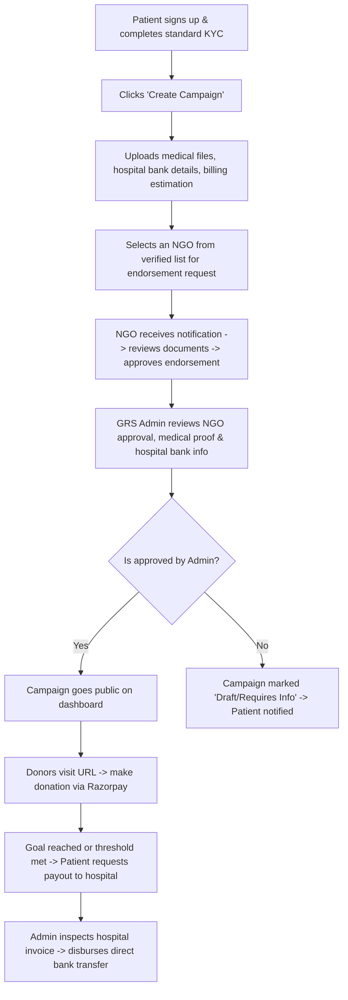
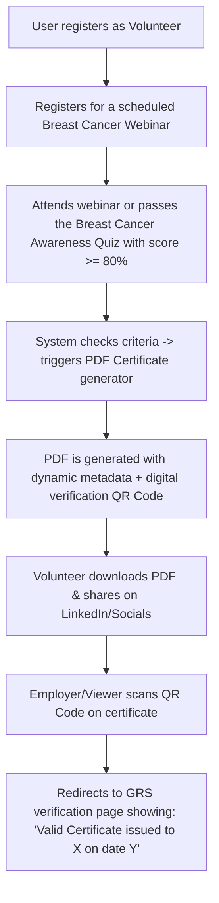
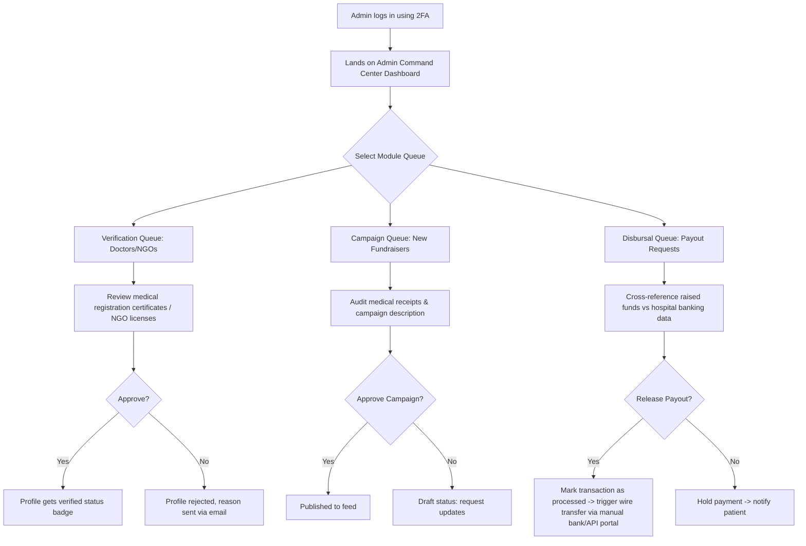
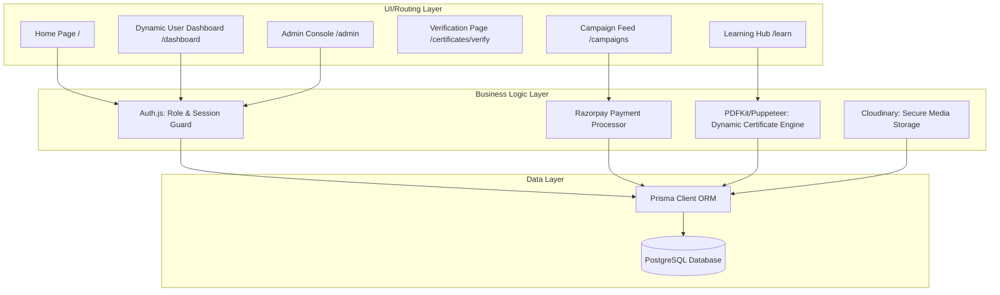

# Product Requirement Document (PRD)
## GRS Breast Cancer Awareness Campaign Platform

**Document Version:** 1.0.0  
**Author:** Lead Systems Architect & Product Manager  
**Date:** July 11, 2026  
**Status:** Under Review (Phase 1)

---

### 1. Project Overview
The **GRS Breast Cancer Awareness Campaign Platform** is an enterprise-grade digital ecosystem designed to unify diverse stakeholders—including patients, medical professionals (doctors/oncologists), donors, NGOs, volunteers, and system administrators—into a single collaborative environment. 

The platform’s mission is twofold:
1. **Spread Awareness:** Act as a reliable, centralized knowledge hub containing interactive self-examination tools, curated educational materials, and certified webinars.
2. **Support & Facilitate Care:** Provide a high-trust medical crowdfunding channel for financially underprivileged breast cancer patients, backstopped by multi-tier verification (NGO & admin review), integrated with Razorpay, and reinforced by automated digital certificate generation.

Built on Next.js 15, TypeScript, Tailwind CSS, shadcn/ui, Prisma ORM, and PostgreSQL, the platform prioritizes security (data encryption at rest/in transit), strict authorization (Role-Based Access Control), high availability, and modern user experience guidelines.

---

### 2. Business Problem
* **Information Fragmentation:** Public awareness information is scattered across unverified blogs, making it hard for women to access trusted, actionable guidance (like Breast Self-Examinations).
* **High Financial Barriers:** Breast cancer treatments (chemotherapy, radiation, immunotherapy, targeted therapy) are prohibitively expensive. Underprivileged patients struggle to raise funds transparently, and individual donors hesitate due to rampant crowdfunding fraud.
* **Lack of Engagement & Volunteer Recognition:** Health campaigns, webinars, and quizzes are run by NGOs, but they lack system-level gamification or automated, secure, and verifiably signed certificates of participation to incentivize student and volunteer engagement.
* **Communication Silos:** Doctors, NGOs, patient advocates, and volunteers work in isolation. Connecting an verified NGO to endorse a patient’s medical bill, or finding a licensed oncologist to vet a campaign, is a highly friction-laden, manual process.

---

### 3. Project Goals
* **Goal 1 (Awareness):** Educate over 100,000+ individuals within the first 12 months using interactive diagnostic guides, medical articles, and webinar schedules.
* **Goal 2 (Crowdfunding Trust):** Achieve a 100% verified status for all active fundraisers by enforcing mandatory double-signature verification (NGO endorsement and GRS Admin audit) before campaigns launch.
* **Goal 3 (Incentivization):** Issue secure, QR-coded, tamper-proof PDF certificates dynamically to webinar attendees and quiz-takers to build a recognized community of breast cancer awareness ambassadors.
* **Goal 4 (Operational Efficiency):** Empower GRS Admins with a command-center style dashboard to audit payouts, manage support requests, block bad actors, and monitor site activity in real time.

---

### 4. Target Audience
1. **General Public / At-risk Individuals:** Primarily women seeking symptoms lists, early screening guidelines, self-test tools, and health blogs.
2. **Underprivileged Breast Cancer Patients & Families:** Individuals who cannot afford surgical/oncological treatment and need to launch fundraising campaigns.
3. **Medical Professionals (Oncologists/Radiologists/Surgeons):** Doctors looking to review patient files, publish educational guides, or host informative webinars.
4. **NGOs & Support Groups:** Entities that organize checkup camps, endorse legitimate campaigns, and run volunteer-driven regional programs.
5. **Volunteers & Students:** Young advocates who want to share campaign links, take educational quizzes, support webinars, and earn certificates.
6. **Individual & Corporate Donors:** Altruistic sponsors seeking transparent, document-verified patient campaigns to finance.

---

### 5. User Roles & Access Matrix

The platform implements fine-grained Role-Based Access Control (RBAC):

| Module / Permission | Guest | Volunteer | Patient | Doctor | NGO Rep | System Admin |
| :--- | :---: | :---: | :---: | :---: | :---: | :---: |
| View Blogs & BSE Guide | ✓ | ✓ | ✓ | ✓ | ✓ | ✓ |
| Browse Verified Campaigns | ✓ | ✓ | ✓ | ✓ | ✓ | ✓ |
| Make Donations (Razorpay) | ✓ | ✓ | ✓ | ✓ | ✓ | ✓ |
| Register for Webinars / Quizzes | ✗ | ✓ | ✓ | ✓ | ✓ | ✓ |
| Download QR-verified Certificates | ✗ | ✓ | ✓ | ✓ | ✓ | ✓ |
| Create Crowdfunding Campaigns | ✗ | ✗ | ✓ | ✗ | ✗ | ✓ |
| Endorse/Vouch for Campaigns | ✗ | ✗ | ✗ | ✗ | ✓ | ✓ |
| Publish Blog Posts / Articles | ✗ | ✗ | ✗ | ✓ | ✗ | ✓ |
| Schedule & Host Webinars | ✗ | ✗ | ✗ | ✓ | ✓ | ✓ |
| Approve/Verify Profiles & Campaigns | ✗ | ✗ | ✗ | ✗ | ✗ | ✓ |
| Manage System Fees & Payouts | ✗ | ✗ | ✗ | ✗ | ✗ | ✓ |

---

### 6. Functional Requirements

#### 6.1 Authentication & Profile Management
* **Multi-Role Registration:** Separate flows for regular users (Patients/Donors/Volunteers), Doctors, and NGOs.
* **Verification Uploads:** Doctors must upload medical registration/license numbers and proof of credentials. NGOs must upload legal registration certificates (e.g., 80G status, registration numbers). Patients must upload diagnosis documents, identity cards, and hospital invoices.
* **OAuth & Credentials Support:** Email/Password via NextAuth + standard social integrations (Google/Facebook).
* **Two-Factor Authentication (Admin Only):** Required for administrative tasks, payout approvals, and database configuration settings.

#### 6.2 Crowdfunding & Donation Engine (FundLife Portal)
* **Campaign Builder:** Rich-text editor for campaigns, goal tracker, medical billing document manager, and video/image gallery uploads.
* **Endorsement Request Pipeline:** Patients can select registered NGOs on the platform to request an endorsement. If an NGO endorses the case, a trust badge is appended to the campaign page.
* **Razorpay Gateway Integration:** Support for Credit/Debit Cards, UPI, NetBanking, and popular Wallets. Support for international transactions if eligible.
* **Anonymity Options:** Donors can choose to hide their name and amount on the public ledger.
* **Financial Auditing:** Visual tracker showing "Goal", "Amount Raised", "Amount Approved for Withdrawal", and "Amount Remaining".
* **Withdrawal Request:** Patients can request fund disbursements directly to hospital bank accounts (system blocks withdrawals to personal bank accounts to prevent fraud).

#### 6.3 Awareness CMS & Interactive Tools
* **Breast Self-Exam (BSE) Guide:** A responsive, interactive web page showing step-by-step visual graphics and timers for systematic physical checks.
* **Quiz Engine:** Multi-choice questions testing users on cancer myths, staging facts, and prevention.
* **Webinar Registry:** System for hosting registration pages for Zoom/Google Meet webinars. Automatically schedules calendar invites and emails.

#### 6.4 QR-Coded PDF Certificate Engine
* **Rule Engine:** User triggers a certificate generation by completing a quiz with a score ≥ 80% or attending a webinar for at least 45 minutes (verified via meeting integration or host marking attendance).
* **PDF Builder:** Server-side generation of a high-quality certificate PDF containing:
  * Participant name, event name, date, and uniquely generated Certificate ID.
  * System cryptographic signature hash.
  * A custom QR Code.
* **Verification Portal:** Public page `/verify-certificate/[id]` which loads when the QR code is scanned. It verifies the validity of the certificate dynamically against the database.

#### 6.5 Admin Management Command Center
* **Moderation Pipeline:** Unified queue to review pending Doctors, NGOs, Campaigns, and Disbursals.
* **Audit Trail Log:** Read-only console tracking admin actions (e.g., "Admin X approved Campaign Y", "Admin Z suspended User W").
* **Dashboard Analytics:** High-level metrics for donations, active webinar registrations, campaign completion rates, and regional traffic.

---

### 7. Non-Functional Requirements

#### 7.1 Performance & UX
* **Lighthouse Score:** Main landing, campaign, and learning pages must achieve a Lighthouse Performance score ≥ 90.
* **Maximum Page Load Time:** First Contentful Paint (FCP) under 1.5 seconds, Largest Contentful Paint (LCP) under 2.5 seconds on average 4G connections.
* **Responsive Layout:** 100% responsive across mobile, tablet, and desktop viewports. Uses Tailwind CSS breakpoints and fluid typography.

#### 7.2 Data Security & Regulatory Integrity
* **HIPAA & Patient Privacy:** Uploaded medical records (diagnosis files, patient ID documents) are stored in secure buckets (e.g., Cloudinary with private access policies or private AWS S3) and served via transient, signed URLs that expire within 10 minutes.
* **Encryption:** Data encrypted in transit using TLS 1.3 and at rest using AES-256 for patient details.
* **GDPR Conformity:** Option for users to request deletion of non-financial profiles. Financial donation transactions are retained per legal requirements.

#### 7.3 High Availability & System Resilience
* **Uptime target:** 99.9% availability achieved through cloud hosting (e.g., Vercel edge routes and Neon/Supabase PostgreSQL serverless clusters).
* **Database Backups:** Automatic daily point-in-time recovery (PITR) backups with a 30-day retention period.

---

### 8. Website Modules

1. **Learning & Self-Screening Module:** Articles, interactive self-check guide, quiz module, and myth-buster database.
2. **Crowdfunding Hub:** Campaign explorer, search engine (filter by target goal, NGO endorsed, status), fundraising story manager, and donation checkout.
3. **Doctor-NGO-Patient Networking Module:** Connection panels where patients search for doctors or request NGO endorsements.
4. **Certificate & PDF Generator:** Asynchronous backend task that pulls template graphics, prints dynamic customer metadata, embeds a generated QR code vector, and triggers a file download.
5. **Admin Operations Center:** Core console for system management.

---

### 9. Complete User Flow

#### 9.1 Patient Journey (Crowdfunding campaign)


#### 9.2 Volunteer / Learner Journey (Quizzes & Webinars)


---

### 10. Complete Admin Flow



---

### 11. Sitemap

```text
/ (Home: Hero, Stats, Interactive BSE Quick-Preview, Call-to-actions)
├── /about (Mission, GRS Team, Contact details)
├── /learn (Awareness Hub)
│   ├── /learn/bse-guide (Interactive Breast Self-Exam timer and layout)
│   ├── /learn/articles (All health blogs and oncology articles)
│   │   └── /learn/articles/[slug] (Individual article viewer)
│   └── /learn/quiz (Awareness Quiz engine)
├── /webinars (Browse scheduled webinars and RSVP)
│   └── /webinars/[id] (Webinar landing page & RSVP form)
├── /campaigns (Crowdfunding Feed: Filters, search, sorts)
│   ├── /campaigns/[id] (Fundraiser details, donor wall, updates, Razorpay button)
│   └── /campaigns/create (Multiphase campaign creation form - Patient role required)
├── /certificates (Public verification directory)
│   └── /certificates/verify/[id] (Dynamic certificate validator page via QR redirect)
├── /dashboard (Unified Portal - Redirects to sub-routes based on auth role)
│   ├── /dashboard/patient (My Campaign, Donation history, NGO status, Withdrawal requests)
│   ├── /dashboard/donor (My donations ledger, tax receipts, impact graphs)
│   ├── /dashboard/doctor (My written articles, webinar list, peer review queue)
│   ├── /dashboard/ngo (Pending patient endorsement requests, endorsed campaigns list)
│   └── /dashboard/volunteer (My RSVP'd webinars, quiz scores, downloaded certificates)
└── /admin (Admin Command Center - Super Admin role required)
    ├── /admin/verifications (Doctors, NGOs profiles review console)
    ├── /admin/campaigns (Fundraiser verification pipeline)
    ├── /admin/disbursals (Hospital billing audit and payout ledger)
    └── /admin/settings (Global controls: system fees, categories, announcement banner)
```

---

### 12. Information Architecture



---

### 13. Feature Prioritization

#### 13.1 Must Have (Phase 1 Scope)
* **Authentication:** NextAuth login/registration, password hashing, secure session management, and Multi-Role Access Control (Admin, NGO, Doctor, Patient, Volunteer, Donor).
* **Campaign Portal:** Campaign listing, search, details page, image/video gallery, and Razorpay donation integration.
* **Verification Pipeline:** Profile review system for GRS Admin (accept/reject Doctors, NGOs, Campaigns).
* **Document Handling:** Uploading patient medical records, doctor credentials, and NGO registration files (stored securely).
* **Certificate System:** Web quiz module, automated dynamic PDF generation with dynamic participant name, unique Certificate ID, and dynamic verification QR code.
* **Public QR Verification Page:** Dynamic lookup system validating authenticity of issued certificates.
* **Basic CMS:** Admin tool to write and publish articles and schedule webinar details.

#### 13.2 Nice to Have (Future Phases)
* **Real-time Patient-NGO Chat:** Internal messaging system using WebSockets for patients to clarify documents directly with checking NGOs.
* **Automated Medical Receipt OCR:** AI parsing of uploaded medical bills to verify patients' funding claims automatically.
* **Doctor Appointment Booking:** A calendar system where patients can schedule virtual consulting slots with oncology partners.
* **Survivor Community Forum:** A forum for breast cancer survivors to discuss recovery, peer support, and share updates.
* **Multilingual support:** Translations for regional Indian languages (Hindi, Tamil, Marathi, Bengali) to increase reach.

---

### 14. Database Planning (Entities & Relationships)

This section maps database entities using Prisma/PostgreSQL styling. All relation keys are denoted logically.

#### 14.1 User
* `id` (UUID, Primary Key)
* `email` (String, Unique)
* `passwordHash` (String)
* `role` (Enum: ADMIN, NGO_REP, DOCTOR, PATIENT, VOLUNTEER, DONOR)
* `name` (String)
* `createdAt` (DateTime)
* `updatedAt` (DateTime)

#### 14.2 Profile
* `id` (UUID, Primary Key)
* `userId` (UUID, Foreign Key referencing User)
* `phoneNumber` (String)
* `avatarUrl` (String, Optional)
* `verificationStatus` (Enum: UNVERIFIED, PENDING, VERIFIED, REJECTED)
* `rejectionReason` (Text, Optional)
* **Doctor Fields:** `medicalLicenseNumber` (String), `hospitalAffiliation` (String), `specialty` (String)
* **NGO Fields:** `ngoRegistrationNumber` (String), `taxExemptionStatus80G` (Boolean), `websiteUrl` (String)
* **Patient Fields:** `nationalIdNumber` (String, Encrypted)

#### 14.3 Campaign
* `id` (UUID, Primary Key)
* `patientId` (UUID, Foreign Key referencing User)
* `title` (String)
* `slug` (String, Unique)
* `description` (Text)
* `medicalSummary` (Text)
* `fundingGoal` (Decimal)
* `amountRaised` (Decimal, Default: 0)
* `status` (Enum: DRAFT, PENDING_NGO, PENDING_ADMIN, ACTIVE, COMPLETED, SUSPENDED)
* `ngoEndorserId` (UUID, Foreign Key referencing User, Optional)
* `hospitalName` (String)
* `hospitalBankAccount` (String, Encrypted)
* `hospitalBankIFSC` (String, Encrypted)
* `createdAt` (DateTime)
* `updatedAt` (DateTime)

#### 14.4 Document
* `id` (UUID, Primary Key)
* `campaignId` (UUID, Foreign Key referencing Campaign, Optional)
* `profileId` (UUID, Foreign Key referencing Profile, Optional)
* `documentType` (Enum: MEDICAL_BILL, DIAGNOSIS_REPORT, IDENTITY_PROOF, NGO_LICENSE, DOCTOR_CREDENTIAL)
* `fileUrl` (String)
* `isSecure` (Boolean, Default: True)
* `createdAt` (DateTime)

#### 14.5 Donation
* `id` (UUID, Primary Key)
* `campaignId` (UUID, Foreign Key referencing Campaign)
* `donorId` (UUID, Foreign Key referencing User, Optional - supporting Anonymous donations)
* `amount` (Decimal)
* `currency` (String, Default: "INR")
* `paymentGatewayId` (String, Razorpay Order ID / Payment ID)
* `status` (Enum: PENDING, SUCCESSFUL, FAILED, REFUNDED)
* `isAnonymous` (Boolean)
* `createdAt` (DateTime)

#### 14.6 Payout
* `id` (UUID, Primary Key)
* `campaignId` (UUID, Foreign Key referencing Campaign)
* `amountRequested` (Decimal)
* `hospitalInvoiceUrl` (String)
* `status` (Enum: PENDING, APPROVED, REJECTED, DISBURSED)
* `transactionReference` (String, Optional)
* `createdAt` (DateTime)

#### 14.7 Certificate
* `id` (UUID, Primary Key)
* `recipientId` (UUID, Foreign Key referencing User)
* `certificateType` (Enum: WEBINAR_ATTENDANCE, QUIZ_EXCELLENCE, VOLUNTEER_CAMPAIGN)
* `eventName` (String)
* `certificateIdString` (String, Unique index - e.g. GRS-2026-XXXX)
* `pdfStorageUrl` (String)
* `verificationHash` (String, Unique SHA-256)
* `createdAt` (DateTime)

---

### 15. API Planning (Endpoint List)

All endpoints reside in the Next.js API Routes layer.

#### 15.1 Authentication (`/api/auth`)
* `POST /api/auth/register` - Create a new user profile with selected roles.
* `POST /api/auth/login` - Authenticate users and return JWT.
* `POST /api/auth/logout` - Invalidate session cookies.

#### 15.2 User Management (`/api/users`)
* `GET /api/users/profile` - Fetch current user profile details.
* `PUT /api/users/profile` - Update profile data (e.g. phone number, bio).
* `POST /api/users/upload-credentials` - Upload licensing files for Doctors/NGOs.

#### 15.3 Campaigns (`/api/campaigns`)
* `GET /api/campaigns` - Fetch verified active campaigns (with pagination & sorting).
* `POST /api/campaigns` - Create a campaign draft.
* `GET /api/campaigns/[id]` - Retrieve single campaign details + public updates.
* `PUT /api/campaigns/[id]` - Update campaign data (draft phase only).
* `POST /api/campaigns/[id]/request-endorsement` - Alert selected NGO to review campaign.

#### 15.4 Donations & Payouts (`/api/donations`)
* `POST /api/donations/create-order` - Generate a Razorpay order ID.
* `POST /api/donations/verify` - Verify webhook or client payment signature and credit campaign.
* `GET /api/donations/my-history` - Fetch authenticated user's donation logs.
* `POST /api/campaigns/[id]/payout-request` - Patient triggers a billing/invoice request.

#### 15.5 Certificates (`/api/certificates`)
* `POST /api/certificates/generate-quiz` - Check quiz inputs; generate and save certificate if passed.
* `GET /api/certificates/verify/[id]` - Public validation lookup returning metadata of the certificate.

#### 15.6 Admin Commands (`/api/admin`)
* `GET /api/admin/pending-verifications` - Fetch queue of unverified entities.
* `POST /api/admin/approve-entity` - Approve/Reject Doctor, NGO, or Campaign.
* `POST /api/admin/approve-payout` - Process payout transaction approval.
* `GET /api/admin/audit-logs` - Query global configuration logs.

---

### 16. Security Requirements

* **Role-Based Session Guards:** Every route and API handler checks session data (`next-auth` JWT or server-side session decryption). Unauthorized roles are blocked with a `403 Forbidden` response.
* **Sensitive Data Encryption:** Fields containing government identity tokens, banking account details, or bank IFSC codes are encrypted using symmetric encryption (`crypto` package with `AES-256-GCM` algorithm) before saving to PostgreSQL.
* **Strict SQL and XSS Protection:** Prisma ORM naturally handles parameterized querying, avoiding SQL injection. Markdown output rendering from editor boxes is sanitized using a library like `DOMPurify` before display.
* **Rate Limiting:** Next.js middleware implements token-bucket rate limiting on critical routes (`/api/auth/login`, `/api/donations/create-order`, `/api/certificates/generate-quiz`) to prevent credential stuffing, API spam, and denial-of-service threats.
* **Safe Document Delivery:** Medical records uploaded to Cloudinary are flagged with restricted access rules. Retrieval requires calling an API route `/api/documents/signed-url/[id]`, which verifies role authorization before delivering a short-lived signature URL.

---

### 17. Scalability Considerations

* **Incremental Static Regeneration (ISR):** Blog pages and awareness pages are built using ISR with a revalidation time of 10 minutes. This offloads database stress by serving cached static HTML pages at edge nodes.
* **Database Connection Pooling:** Postgres connections from serverless Next.js functions scale rapidly. Connection pooling via Prisma Accelerate or Neon/PgBouncer is mandatory to prevent connection exhaustion limit issues.
* **Asset Offloading:** All image resources (landing images, self-help images) and user files (PDFs, reports) are hosted and optimized directly on Cloudinary CDN, ensuring lightning-fast load times.
* **Async PDF Handling:** For heavy traffic spikes (e.g., thousands of certificate queries after a webinar), generation is processed via lightweight serverless routes using highly optimized PDF generation libraries (like `PDFKit` or client-side generation checks supported by server-side dynamic validation keys) to minimize RAM usage.

---

### 18. Future Scope

* **Tele-Health Consultations:** Integrate live video consultancy rooms using Twilio or WebRTC, enabling breast cancer survivors or patients to talk directly to oncologist partners securely.
* **AI-Guided Diagnostics Assistance:** Incorporate Computer Vision modules that can screen mammogram scan reports to flag potential areas of interest (solely for educational preview and advising doctor checkups).
* **Regional Support Network:** Introduce maps and locating APIs (Google Maps API) showing regional diagnostic centers, support communities, and free mammogram camps near the user.
* **Government Subsidy Integration:** Automatically cross-reference patients' eligibility for national health grants or support networks (like Ayushman Bharat PM-JAY in India) during sign-up.

---

### 19. Development Roadmap

* **Phase 1: PRD Definition & Database Planning** (Current Phase - Core requirements definition, flows, and API blueprints).
* **Phase 2: Base System Setup & Auth Integration** (Next.js config, Tailwind setup, database schema migration, multi-role auth).
* **Phase 3: CMS & Event Module** (Blogs CMS, interactive BSE guide page, webinar RSVP form, and Quiz module).
* **Phase 4: Crowdfunding Integration** (Campaign layout, multi-step creator, file manager integration, and Razorpay gateway hook).
* **Phase 5: Digital Certification Engine** (Server-side dynamic PDF constructor, QR routing system, public check verification endpoint).
* **Phase 6: Admin dashboard** (Control board, moderation panels, secure medical document auditing dashboard, and financial reports).
* **Phase 7: Auditing, Polish & Release** (Rigorous security checks, manual UX runs, connection pool stress tests, launch).

---

### 20. Risks and Assumptions

* **Regulatory Hurdles:** Crowdfunding platforms in India must adhere to complex financial rules regarding tax exemptions (80G) and foreign currency donations (FCRA). *Mitigation:* Limit payments to domestic (INR) transfers initially; restrict transactions strictly to hospital accounts rather than patient personal accounts.
* **Fundraising Fraud:** Malicious entities could upload fake diagnosis slips or fake hospital quotes. *Mitigation:* Ensure a mandatory dual-verification layer. No campaign goes public without a verified NGO reviewing the physical records, followed by a final GRS admin verification.
* **Medical Liabilities:** Offering blogs or interactive BSE tools might be construed as providing certified clinical diagnoses. *Mitigation:* Implement standard disclaimers stating: *"This tool is solely for awareness and general educational guidance, and does not serve as a clinical medical diagnosis. Please consult a registered oncologist for professional medical advice."*
* **Sensitive Patient Records Exposure:** Potential leakage of patient diagnostic results or national identity cards. *Mitigation:* Ensure strict, short-lived signed URL retrieval rules for all files stored in Cloudinary secure storage buckets.

---
*End of Phase 1 Document. Awaiting stakeholder approval.*
